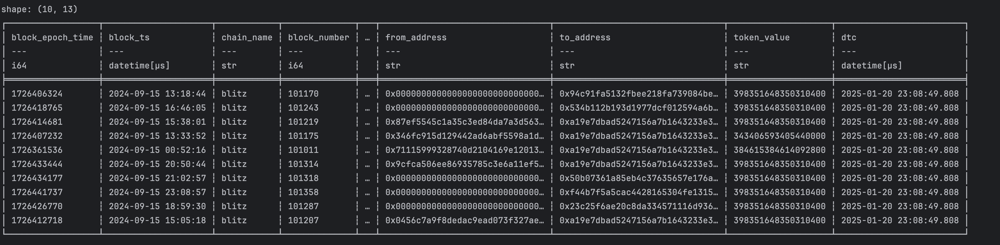

# A Data Engineer’s Introduction to Rust

This repository demonstrates how to build a simple data processing application in Rust. The example covers connecting to AWS S3 to download a Parquet file, reading it into a DataFrame using the Polars library, filtering the data, and printing a preview of the results—all using asynchronous Rust with Tokio.

## Overview

In this example, you will learn how to:

- **Configure AWS SDK for Rust:** Set up your AWS connection to access S3.
- **Download Data from S3:** Retrieve a Parquet file from a specified bucket and key.
- **Process Data with Polars:** Use the Polars library to read the Parquet file into a DataFrame, filter rows where the `token_value` column is not null, and display the first 10 rows.
- **Leverage Asynchronous Programming:** Run asynchronous tasks with Tokio.

## Prerequisites

### Installing Rust on MacOS

To install Rust on your Mac, follow these steps:

1. Open your terminal.

2. Run the following command to install Rust using `rustup`:

   ```bash
   curl --proto '=https' --tlsv1.2 -sSf https://sh.rustup.rs | sh
   ```

3. Follow the on-screen instructions.

4. Verify the installation:

   ```bash
   rustc --version
   ```

You should see the version of Rust installed.

## Code Walkthrough

### 1. AWS SDK Configuration

The code starts by loading the AWS configuration for the `us-east-1` region using a specific behavior version. It then creates an S3 client:

```rust
let config = defaults(BehaviorVersion::v2025_01_17())
    .region(Region::new("us-east-1"))
    .load()
    .await;
let client = Client::new(&config);
```

### 2. Retrieving the Parquet File from S3

The S3 bucket and key are defined, and an asynchronous request is made to fetch the object. If successful, the body of the response is collected into a `Bytes` object:

```rust
let bucket = "s3-lakehouse";
let key = "lakehouse/transfers-50276732ab2541e898f2ce3dd3de7055/chain_id=1344/transfer_type=ERC20/block_date=2024-09-15/20250316_172112_16476_7uqww_f91817d4-a0e7-4e04-98dc-85f1319fab3e";

let s3_payload: Option<Bytes> = match client.get_object().bucket(bucket).key(key).send().await {
    Ok(resp) => {
        let payload = resp.body
            .collect()
            .await
            .map_err(|e| Box::new(e) as Box<dyn std::error::Error>)?
            .into_bytes();
        Some(payload)
    }
    Err(e) => {
        return Err(Box::new(e) as Box<dyn std::error::Error>);
    }
};
```

### 3. Processing the Data with Polars

If the payload is available, it is converted into a cursor and passed to the `ParquetReader` to load the data into a Polars DataFrame. The DataFrame is then filtered to include only rows where `token_value` is not null, and the first 10 rows of the filtered DataFrame are printed:

```rust
if let Some(payload) = s3_payload {
    let cur = Cursor::new(payload);
    let df = ParquetReader::new(cur).finish();
    let show = df.unwrap();
    let fil = show.filter(&show.column("token_value").unwrap().is_not_null());
    println!("{}", fil.unwrap().head(Some(10)));
}
```

## Running the Example

1. **Clone the Repository:**

   ```bash
   git clone https://github.com/your-username/data-engineers-introduction-to-rust.git
   cd data-engineers-introduction-to-rust
   ```

2. **Build and Run:**

   ```bash
   cargo run
   ```
3. **Output:**
   


## License

This project is licensed under the MIT License. See the [LICENSE](LICENSE) file for details.

