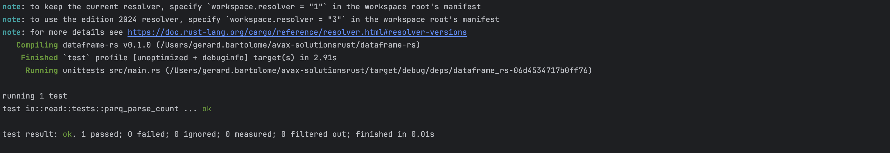

# A Data Engineer’s Introduction to Rust

This repository demonstrates how to build a simple data processing application in Rust. The example covers connecting to AWS S3 to download a Parquet file and many more as the repo progresses. These examples are catered for modern Data Engineering uses cases using idioms within the Rust paradigm. 

### Polars and Tokio?
Tokio provides an asynchronous runtime using Rust’s futures to handle non-blocking I/O, allowing thousands of concurrent connections with lightweight tasks scheduled on a small pool of threads. Its event-driven model makes it ideal for I/O-bound applications such as network servers or microservices.

In contrast, Polars is optimized for high-performance data manipulation via DataFrames, leveraging parallel processing to perform filtering, aggregation, and joins across multiple CPU cores. Think of it is as Pandas on steroids, with memory and type saftey bundled in Rust! It harnesses multi-threading, SIMD optimizations, and a lazy evaluation API to execute operations in parallel while minimizing unnecessary computations.

Together, Tokio and Polars enable Rust applications to efficiently scale by managing concurrent I/O-bound tasks and maximizing multi-core parallelism with a lightweight and lazy approach.


## Overview

In this example, you will learn how to:

- **Configure AWS SDK for Rust:** Set up your AWS connection to access S3.
- **Download Data from S3:** Retrieve a Parquet file from a specified bucket and key.
- **Process Data with Polars:** Use the Polars library to read the Parquet file into a DataFrame, filter rows where the `token_value` column is not null, and display the first 10 rows.
- **Leverage Asynchronous Programming:** Run asynchronous tasks with Tokio.

## Prerequisites

### Installing Rust on MacOS

To install Rust on your Mac, follow these steps:

1. Open your terminal.

2. Run the following command to install Rust using `rustup`:

   ```bash
   curl --proto '=https' --tlsv1.2 -sSf https://sh.rustup.rs | sh
   ```

3. Follow the on-screen instructions.

4. Verify the installation:

   ```bash
   rustc --version
   ```

You should see the version of Rust installed.

## Running the Example

1. **Clone the Repository:**

   ```bash
   git clone https://github.com/polyglotDataNerd/dataframe-rs.git
   cd dataframe-rs
   ```

2. **Build and Run:**

   ```bash
   cargo run
   cargo test
   ```
3. **Output:**
   
4. **Test Output**



## License

This project is licensed under the MIT License. See the [LICENSE](LICENSE) file for details.

